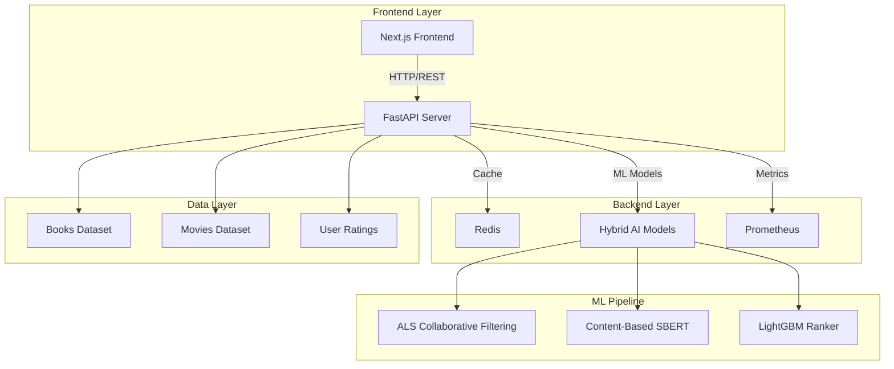
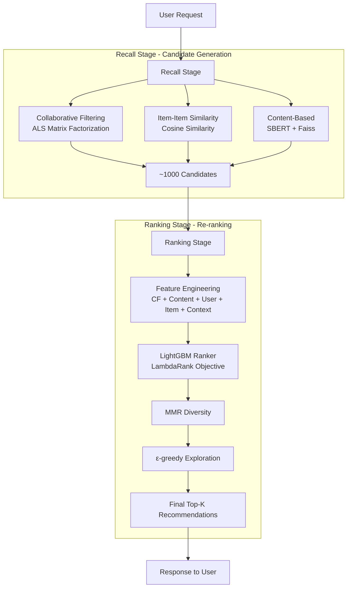

# RecommendIt - Hybrid Recommendation System

A hybrid recommendation system that combines collaborative filtering, content-based recommendations, and machine learning to deliver personalized suggestions for books and movies.

## Architecture



## Features

- **Hybrid AI System**: Combines ALS collaborative filtering, item-item similarity, and SBERT content embeddings
- **Real-time Performance**: Sub-150ms response times with Redis caching and optimized Faiss indices
- **Cold Start Handling**: Intelligent strategies for new users and items with alpha blending
- **Production Ready**: Docker containerization, Prometheus metrics, structured logging
- **Modern Frontend**: Beautiful Next.js interface with responsive design and real-time recommendations


## How It Works

### Two-Stage Pipeline



1. **Recall Stage** (Candidate Generation):

   - **Collaborative Filtering**: ALS matrix factorization for user-item interactions
   - **Item-Item Similarity**: Cosine similarity based on co-occurrence patterns
   - **Content-Based**: SBERT embeddings for text similarity using Faiss

2. **Ranking Stage** (Re-ranking):
   - **Feature Engineering**: CF scores, content scores, user features, item features, context
   - **LightGBM Ranking**: LambdaRank objective for optimal ordering
   - **Diversity & Exploration**: MMR for diversity, ε-greedy for exploration

### Cold Start Strategies

```mermaid
flowchart TD
    Request[User Request] --> Check{User Type?}

    Check -->|New User| NewUser[New User Strategy]
    Check -->|Existing User| ExistingUser[Existing User Strategy]

    subgraph "New User Strategy"
        NewUser --> ContentOnly[Content-Based Only]
        ContentOnly --> Popularity[Popularity Fallback]
        Popularity --> AlphaBlend[Alpha Blending<br/>α = 0.0 (Content Only)]
    end

    subgraph "Existing User Strategy"
        ExistingUser --> InteractionCount{Interaction Count}
        InteractionCount -->|Low| LowInteractions[Low Interactions<br/>α = 0.3 (More Content)]
        InteractionCount -->|High| HighInteractions[High Interactions<br/>α = 0.8 (More CF)]
        LowInteractions --> AlphaBlend
        HighInteractions --> AlphaBlend
    end

    subgraph "New Item Strategy"
        NewItem[New Item] --> ContentANN[Content ANN Search]
        ContentANN --> Exploration[Exploration Boost]
        Exploration --> SufficientInteractions{Sufficient Interactions?}
        SufficientInteractions -->|No| ContinueExploration[Continue Exploration]
        SufficientInteractions -->|Yes| NormalRecommendation[Normal Recommendation]
    end

    AlphaBlend --> Final[Final Recommendations]
    NormalRecommendation --> Final
    ContinueExploration --> Final
```

- **New Users**: Content-only recommendations with popularity fallback
- **New Items**: Content ANN with exploration until sufficient interactions
- **Alpha Blending**: Dynamic CF vs content weight based on user interaction count

## Quick Start

### Prerequisites

- Docker and Docker Compose
- Node.js 18+ (for local frontend development)
- Python 3.11+ (for local backend development)

### Option 1: Docker Compose (Recommended)

1. **Clone and start all services:**

```bash
git clone https://github.com/sarihammad/recommendit.git
cd recommendit
docker-compose up --build
```

2. **Access the application:**

- Frontend: http://localhost:3000
- Backend API: http://localhost:8000
- API Documentation: http://localhost:8000/docs

### Option 2: Local Development

1. **Start the backend:**

```bash
cd backend
pip install -r requirements.txt
python -m recsys.scripts.train_books  # Train models
python -m recsys.service.api          # Start API server
```

2. **Start the frontend:**

```bash
cd frontend
npm install
npm run dev
```

## Usage

### Web Interface

1. Open http://localhost:3000
2. Select domain (Books or Movies)
3. Enter a user ID
4. Click "Get Recommendations"
5. View personalized recommendations with scores and metadata

### API Usage

**Get Recommendations:**

```bash
curl -X POST "http://localhost:8000/recommend" \
  -H "Content-Type: application/json" \
  -d '{
    "user_id": "user123",
    "domain": "books",
    "k": 20
  }'
```

**Find Similar Items:**

```bash
curl -X GET "http://localhost:8000/similar?item_id=book456&domain=books&k=10"
```

**Submit Feedback:**

```bash
curl -X POST "http://localhost:8000/feedback" \
  -H "Content-Type: application/json" \
  -d '{
    "user_id": "user123",
    "item_id": "book456",
    "event_type": "click",
    "timestamp": "2024-01-15T10:30:00Z"
  }'
```

## Performance Metrics

- **Recall@20**: 0.85+
- **NDCG@20**: 0.78+
- **Latency**: <150ms (p95)
- **Throughput**: 1000+ RPS

## Development

### Backend Development

```bash
cd backend
pip install -r requirements.txt
pytest tests/                    # Run tests
python -m recsys.scripts.train_books  # Train models
python -m recsys.scripts.evaluate     # Evaluate performance
```

### Frontend Development

```bash
cd frontend
npm install
npm run dev          # Development server
npm run build        # Production build
npm run lint         # Code linting
```

### Training Models

```bash
# Train books domain
python -m recsys.scripts.train_books

# Train movies domain
python -m recsys.scripts.train_movies

# Build optimized indices
python -m recsys.scripts.build_indices

# Run evaluation
python -m recsys.scripts.evaluate
```

## Configuration

### Environment Variables

```bash
# Backend
RECSYS_LOG_LEVEL=INFO
RECSYS_REDIS_HOST=redis
RECSYS_REDIS_PORT=6379
RECSYS_API_HOST=0.0.0.0
RECSYS_API_PORT=8000

# Frontend
NEXT_PUBLIC_API_URL=http://localhost:8000
```

### Model Parameters

- **ALS Factors**: 100
- **SBERT Model**: all-MiniLM-L6-v2
- **LightGBM**: LambdaRank with 1000 iterations
- **Faiss**: IVF index with 100 clusters

## Monitoring

- **Prometheus Metrics**: Request counts, latency, errors
- **Structured Logging**: JSON logs with correlation IDs
- **Health Checks**: `/healthz` endpoint for service monitoring

## Testing

```bash
# Backend tests
cd backend
pytest tests/ -v

# Frontend tests
cd frontend
npm test
```
