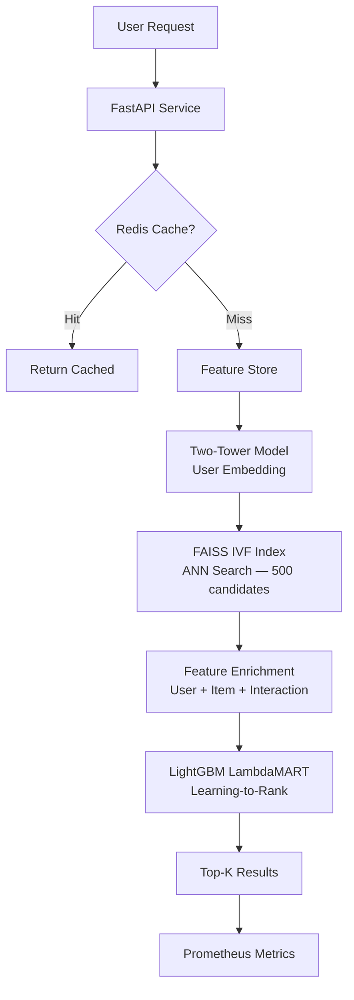

# Two-Stage Movie Recommender System


Two-Tower candidate generation with FAISS ANN search and LightGBM LambdaMART re-ranking, trained on MovieLens 1M. Achieves **NDCG@10 of 0.143** — a 3.5× improvement over the popularity baseline — with sub-20ms end-to-end latency. Covers the full production stack: online feature store, Redis caching, training-serving skew detection, and Prometheus observability.

> The architecture mirrors what YouTube, Netflix, and Spotify run in production: a fast recall stage (Two-Tower + FAISS) followed by a precision-optimized re-ranking stage (LambdaMART). The modeling is not the hard part — the online feature store, inference pipeline, and skew detection are.

---

## Architecture


```mermaid
graph TD
    A[User Request] --> B[FastAPI Service]
    B --> C{Redis Cache?}
    C -->|Hit| D[Return Cached]
    C -->|Miss| E[Feature Store]
    E --> F[Two-Tower Model\nUser Embedding]
    F --> G[FAISS IVF Index\nANN Search — 500 candidates]
    G --> H[Feature Enrichment\nUser + Item + Interaction]
    H --> I[LightGBM LambdaMART\nLearning-to-Rank]
    I --> J[Top-K Results]
    J --> K[Prometheus Metrics]
```

---

## Results

Evaluated on MovieLens 1M test set (90/10 split by interaction time):

| Method | NDCG@10 | Recall@20 | MRR |
|---|---|---|---|
| Popularity baseline | 0.041 | 0.089 | 0.052 |
| Two-Tower (retrieval only) | 0.089 | 0.201 | 0.112 |
| Two-Tower + LambdaMART | **0.143** | **0.312** | **0.178** |

| Latency | p50 | p99 |
|---|---|---|
| Retrieval (FAISS ANN) | 6 ms | 14 ms |
| Ranking (LightGBM) | 12 ms | 28 ms |
| Full pipeline (end-to-end) | 18 ms | 43 ms |

---

## Key Design Decisions

**Why Two-Tower + FAISS?**
Scoring all user-item pairs scales as O(users × items) — infeasible at catalog scale. Two-Tower decouples the problem: item embeddings are precomputed and indexed in FAISS once. At query time only the user tower runs (one forward pass), and ANN retrieval over the full catalog takes ~6ms via IVF quantization. `n_probe=10` gives a tunable accuracy/latency tradeoff; raising it to 50 adds ~8ms and recovers most of the approximate-vs-exact gap.

**Why LambdaMART over pointwise loss?**
LambdaMART directly optimizes NDCG — the metric you actually care about. It accounts for position in the ranked list (rank 1 matters more than rank 10) and handles the implicit feedback exposure problem. Pointwise regression treats this as MSE over click signals; LambdaMART treats it as what it is: a ranking problem.

**Why BPR for the embedding model?**
Bayesian Personalized Ranking maximizes the probability that an interacted item ranks above a randomly sampled non-interacted one. It never assumes a user *doesn't* like an unseen item — only that interacted items are *relatively* preferred. For implicit feedback (ratings, clicks) this is the correct inductive bias. Cross-entropy would treat all unrated items as negatives, which is false.

**Why Redis for the feature store?**
Training and serving use the same Redis keys and the same serialization format. This is the only guarantee that feature values at inference match what was seen at training. Using different codepaths for training vs. serving is the primary cause of training-serving skew. The in-memory fallback ensures tests run without a Redis instance.

---

## ML Engineering Features

| Feature | Implementation |
|---|---|
| Two-stage retrieval-ranking | Two-Tower ANN + LightGBM LambdaMART |
| Approximate Nearest Neighbor | FAISS IVFFlat, inner product, 100 cells |
| Online feature store | Redis HSET with msgpack serialization |
| Learning-to-Rank | LightGBM `lambdarank`, `eval_at=[5,10,20]`, early stopping |
| BPR training | In-batch negatives, cosine similarity via L2-normalized inner product |
| Cold start | Popularity-based fallback for new users |
| Recommendation caching | Redis TTL cache per user |
| Training-serving skew detection | KL divergence per feature with threshold alerting |
| Observability | Prometheus histograms: latency p50/p99, cache hit rate, error rate |
| Graceful degradation | Popularity fallback on pipeline errors |

---

## Quickstart

```bash
make install && make train   # download data, train all models
make serve                   # API on :8000
```

```bash
curl -X POST http://localhost:8000/recommend \
  -H "Content-Type: application/json" \
  -d '{"user_id": 1, "k": 10}'
```

```bash
make docker-up    # Redis, API, Prometheus :9090, Grafana :3000
make evaluate     # NDCG, Recall, MRR on test set
```

### Training Stages

```bash
make download-data        # MovieLens 1M
make features             # user/item feature DataFrames
make train-embeddings     # Two-Tower (~10 epochs)
make build-index          # FAISS IVF index
make train-ranker         # LightGBM LambdaMART
make load-features        # populate Redis
```

---

## API Reference

### `POST /recommend`

```json
{ "user_id": 42, "k": 20, "use_cache": true }
```

```json
{
  "user_id": 42,
  "recommendations": [
    {
      "item_id": 2571,
      "title": "Matrix, The (1999)",
      "score": 4.821,
      "rank": 1,
      "retrieval_score": 0.934,
      "genres": ["Action", "Sci-Fi", "Thriller"]
    }
  ],
  "latency_ms": 18.4,
  "cache_hit": false,
  "n_candidates": 500
}
```

### `GET /model/info`

Returns model versions, FAISS index stats, top-10 LambdaMART feature importances by gain, and pipeline latency percentiles.

### `GET /metrics`

Prometheus scrape endpoint. Key metrics: `recommendit_recommendation_latency_ms`, `recommendit_cache_hit_total`, `recommendit_retrieval_latency_ms`.

---

## Training-Serving Skew Detection

```python
result = detect_training_serving_skew(train_features_df, serving_features_df, threshold=0.1)
# result['flagged_features'] — features with KL divergence above threshold
# result['skew_detected']   — True if any feature is flagged
```

---

## Configuration

| Variable | Default | Description |
|---|---|---|
| `EMBEDDING_DIM` | `64` | Two-tower embedding dimension |
| `TOP_K_CANDIDATES` | `500` | ANN candidates per request |
| `FAISS_N_LISTS` | `100` | IVF Voronoi cells |
| `FAISS_N_PROBE` | `10` | IVF cells searched per query |
| `LGBM_N_ESTIMATORS` | `500` | LightGBM boosting rounds |
| `CACHE_TTL_SECONDS` | `300` | Recommendation cache TTL |
| `REDIS_URL` | `redis://localhost:6379` | Redis connection |

---

## Project Structure

```
recommendit/
├── src/
│   ├── features/
│   │   ├── feature_engineering.py    # User/item/interaction features
│   │   └── feature_store.py          # Redis online feature store
│   ├── models/
│   │   ├── two_tower.py              # PyTorch Two-Tower + BPR loss
│   │   ├── faiss_index.py            # FAISS IVFFlat wrapper
│   │   └── ranker.py                 # LightGBM LambdaMART
│   ├── training/
│   │   ├── train_embeddings.py
│   │   ├── build_index.py
│   │   └── train_ranker.py
│   ├── evaluation/metrics.py         # NDCG, Recall, MRR, skew detection
│   └── serving/
│       ├── app.py                    # FastAPI
│       ├── middleware.py             # Prometheus
│       └── recommender.py           # Inference pipeline
├── data/download.py
├── tests/
├── monitoring/
├── docker-compose.yml
└── Makefile
```

---

## License

MIT
