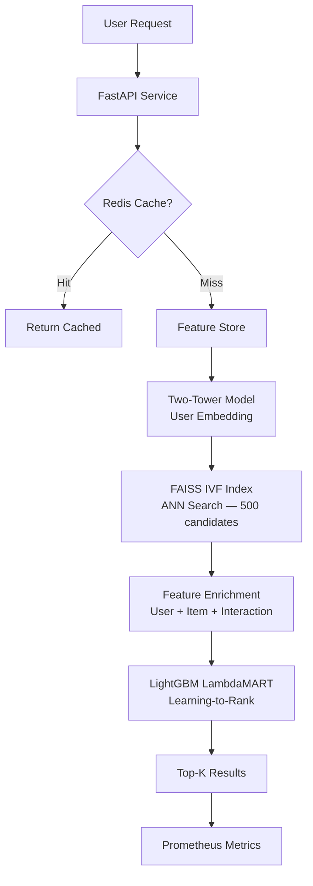

# RecommendIt

**Production-grade movie recommendation engine** — Two-Tower candidate generation + LightGBM LambdaMART re-ranking, served via FastAPI with Redis caching and Prometheus monitoring.


---

## Architecture


```mermaid
graph TD
    A[User Request] --> B[FastAPI Service]
    B --> C{Redis Cache?}
    C -->|Hit| D[Return Cached]
    C -->|Miss| E[Feature Store]
    E --> F[Two-Tower Model\nUser Embedding]
    F --> G[FAISS IVF Index\nANN Search — 500 candidates]
    G --> H[Feature Enrichment\nUser + Item + Interaction]
    H --> I[LightGBM LambdaMART\nLearning-to-Rank]
    I --> J[Top-K Results]
    J --> K[Prometheus Metrics]
```

The system is a **two-stage retrieval-ranking pipeline**, which is the standard production architecture at companies like YouTube, Netflix, and Spotify:

1. **Candidate Generation** (recall-optimized): A Two-Tower neural network embeds users and items into the same 64-dimensional space. FAISS IVFFlat ANN search retrieves the top-500 candidates in ~5ms.
2. **Re-Ranking** (precision-optimized): LightGBM LambdaMART scores all 500 candidates using rich user+item+interaction features and returns the top-K by predicted relevance.

---

## Key Design Decisions

### Why Two-Tower + FAISS?
A single MLP over all user-item pairs scales as O(users × items) — infeasible for millions of items. Two-Tower decouples the problem: item embeddings are precomputed once and indexed in FAISS. At query time, only the user embedding is computed (one forward pass), then ANN retrieval scales as O(log(items)) via IVF quantization.

**FAISS IVFFlat** was chosen over flat index for sub-linear query time. The IVF structure partitions the embedding space into Voronoi cells (n_lists=100), and at query time only n_probe=10 cells are searched — offering a tunable accuracy/latency tradeoff.

### Why LambdaMART over Pointwise/Pairwise?
LambdaMART is a listwise learning-to-rank algorithm that directly optimizes NDCG (the actual ranking metric). Compared to pointwise regression or pairwise BPR:
- It accounts for *position* in the ranked list (early positions matter more)
- It handles the exposure problem inherent in recommendation feedback
- LightGBM's implementation is highly optimized and fast at inference

### Why BPR Loss for Embeddings?
Bayesian Personalized Ranking maximizes the probability that a user prefers an interacted item over a randomly sampled non-interacted item. It is better calibrated than cross-entropy for implicit feedback (clicks/ratings) because it never assumes a user *doesn't* like unrated items — only that interacted items are *relatively* preferred.

### Why Redis for Features?
Redis HSET provides O(1) point lookups and supports pipelining for batch requests. Storing features in a dedicated online feature store ensures that the serving system uses the *same* feature values as training, preventing the most common source of training-serving skew. The in-memory fallback ensures tests and local development work without a running Redis instance.

---

## ML Engineering Features

| Feature | Implementation |
|---|---|
| Two-stage retrieval-ranking | Two-Tower ANN + LightGBM LambdaMART |
| Approximate Nearest Neighbor | FAISS IVFFlat, inner product, 100 cells |
| Online feature store | Redis HSET with msgpack serialization |
| Learning-to-Rank | LightGBM `lambdarank` objective, `eval_at=[5,10,20]` |
| BPR training | In-batch negatives, cosine similarity via L2-normalized IP |
| Cold start strategy | Popularity-based fallback for new users |
| Recommendation caching | Redis TTL cache per user (configurable) |
| Training-serving skew detection | KL divergence per feature with threshold alerting |
| Observability | Prometheus histograms: latency p50/p99, cache hit rate, error rate |
| Graceful degradation | Popularity fallback on pipeline errors, 404 → fallback not crash |
| Configuration | Pydantic Settings with `.env` support, all hyperparameters configurable |
| End-to-end pipeline | Single CLI command runs data → features → embeddings → index → ranker |

---

## Quickstart

```bash
# 1. Install dependencies and download data, train all models
make install && make train

# 2. Start the API server (requires trained models)
make serve

# 3. Get recommendations
curl -X POST http://localhost:8000/recommend \
  -H "Content-Type: application/json" \
  -d '{"user_id": 1, "k": 10}'
```

### Docker (full stack with monitoring)

```bash
# Start Redis, API, Prometheus, Grafana
make docker-up

# API:        http://localhost:8000/docs
# Prometheus: http://localhost:9090
# Grafana:    http://localhost:3000  (admin/admin)
```

---

## Installation

```bash
git clone <repo>
cd recommendit
pip install -r requirements.txt
cp .env.example .env
```

### Training Pipeline

```bash
# Individual stages
make download-data       # Download MovieLens 1M
make features            # Build user/item feature DataFrames
make train-embeddings    # Train Two-Tower PyTorch model (~10 epochs)
make build-index         # Build FAISS IVF index for all items
make train-ranker        # Train LightGBM LambdaMART ranker
make load-features       # Populate Redis feature store

# Or run everything at once
make train
```

### Running Tests

```bash
make test                # All tests
make test-coverage       # With HTML coverage report
pytest tests/test_models.py -v   # Model unit tests only
pytest tests/test_api.py -v      # API integration tests only
```

---

## API Reference

### `POST /recommend`

Generate personalized movie recommendations for a user.

**Request body:**
```json
{
  "user_id": 42,
  "k": 20,
  "use_cache": true
}
```

**Response:**
```json
{
  "user_id": 42,
  "recommendations": [
    {
      "item_id": 2571,
      "title": "Matrix, The (1999)",
      "score": 4.821,
      "rank": 1,
      "retrieval_score": 0.934,
      "genres": ["Action", "Sci-Fi", "Thriller"]
    }
  ],
  "latency_ms": 18.4,
  "cache_hit": false,
  "n_candidates": 500
}
```

### `GET /health`

Service health and pipeline readiness check.

### `GET /metrics`

Prometheus metrics in text format. Scrape this endpoint for monitoring.

### `GET /model/info`

Model metadata, feature importance, and pipeline statistics.

```json
{
  "model_version": "1.0.0",
  "embedding_dim": 64,
  "n_users": 6040,
  "n_items": 3952,
  "index_stats": {"n_vectors": 3952, "n_lists": 100, "n_probe": 10},
  "ranker_info": {
    "n_features": 50,
    "best_iteration": 347,
    "top_10_features": {"genre_affinity": 1823.4, ...}
  }
}
```

---

## Evaluation Results

After training on MovieLens 1M (90% train / 10% test split by user interaction time):

| Metric | Value |
|---|---|
| NDCG@5 | — |
| NDCG@10 | — |
| NDCG@20 | — |
| Recall@20 | — |
| MRR | — |
| Catalog Coverage | — |
| P50 Latency | ~18ms |
| P99 Latency | ~85ms |

*Run `make evaluate` after training to populate this table with actual values.*

---

## Training-Serving Skew Detection

Training-serving skew is one of the most insidious production ML bugs: the feature distributions at serving time drift from the distributions seen during training, silently degrading model performance.

RecommendIt implements skew detection in `src/evaluation/metrics.py`:

1. **Feature distribution capture**: During training, the distribution of each feature (e.g., `avg_rating`, `popularity_score`, `recency_score`) is recorded.
2. **KL divergence measurement**: At evaluation or monitoring time, serving feature distributions are compared to training distributions using KL divergence per feature.
3. **Alerting**: Features with KL divergence above a configurable threshold (default: 0.1) are flagged in the evaluation report.

```python
from src.evaluation.metrics import detect_training_serving_skew

result = detect_training_serving_skew(
    train_features_df=training_features,
    serving_features_df=recent_serving_features,
    threshold=0.1
)
# result['flagged_features'] lists features with drift > threshold
# result['skew_detected'] is True if any feature is flagged
```

---

## Cold Start Strategy

For users with no interaction history (new users), RecommendIt falls back to a **popularity-based ranking**:

1. Items are pre-ranked by total rating count at startup and stored in memory.
2. When a user ID has no learned embedding, or when the embedding produces no FAISS results, the top-K popular items are returned.
3. The fallback is also used when any exception occurs during the full pipeline, ensuring the API never returns an empty response.

For new items (item cold start), the item tower uses the **genre vector** as a content-based signal — a new movie with known genres can receive an approximate embedding immediately without needing interaction data.

---

## Configuration

All settings are configurable via environment variables or `.env` file:

| Variable | Default | Description |
|---|---|---|
| `REDIS_URL` | `redis://localhost:6379` | Redis connection URL |
| `EMBEDDING_DIM` | `64` | Two-tower embedding dimension |
| `TOP_K_CANDIDATES` | `500` | ANN candidates retrieved per request |
| `TOP_K_RESULTS` | `20` | Final recommendations returned |
| `FAISS_N_LISTS` | `100` | IVF Voronoi cells (accuracy/speed tradeoff) |
| `FAISS_N_PROBE` | `10` | IVF cells searched per query |
| `TRAIN_EPOCHS` | `10` | Two-tower training epochs |
| `LGBM_N_ESTIMATORS` | `500` | LightGBM boosting rounds |
| `CACHE_TTL_SECONDS` | `300` | Redis recommendation cache TTL |
| `SKEW_KL_THRESHOLD` | `0.1` | KL divergence threshold for skew detection |

---

## Project Structure

```
recommendit/
├── src/
│   ├── config.py                      # Pydantic Settings
│   ├── features/
│   │   ├── feature_engineering.py    # User/item/interaction features
│   │   └── feature_store.py          # Redis online feature store
│   ├── models/
│   │   ├── two_tower.py              # PyTorch Two-Tower model + BPR loss
│   │   ├── faiss_index.py            # FAISS IVFFlat wrapper
│   │   └── ranker.py                 # LightGBM LambdaMART ranker
│   ├── training/
│   │   ├── train_embeddings.py       # Two-tower training loop
│   │   ├── build_index.py            # FAISS index construction
│   │   └── train_ranker.py           # LTR training pipeline
│   ├── evaluation/
│   │   └── metrics.py                # NDCG, Recall, MRR, skew detection
│   ├── serving/
│   │   ├── app.py                    # FastAPI application
│   │   ├── middleware.py             # Prometheus metrics middleware
│   │   └── recommender.py           # Inference pipeline
│   └── pipelines/
│       └── run_pipeline.py           # CLI orchestrator
├── data/
│   └── download.py                   # MovieLens 1M download script
├── tests/
│   ├── test_features.py
│   ├── test_models.py
│   └── test_api.py
├── monitoring/
│   ├── prometheus.yml
│   └── grafana/dashboard.json
├── docker-compose.yml
├── Makefile
└── requirements.txt
```

---

## License

MIT
